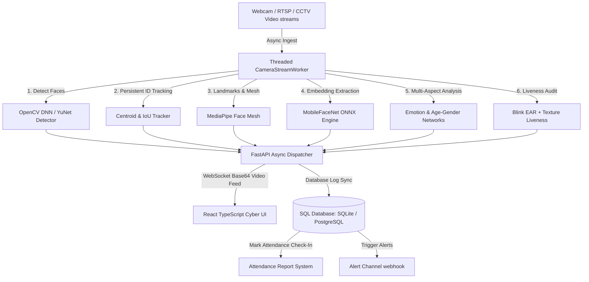

# Enterprise AI Face Analytics, Attendance, & Security Platform (2026)

This repository hosts a production-grade, state-of-the-art **Enterprise AI Face Analytics, Multi-Camera Ingestion, Attendance Management, and Security Monitoring Platform** built using a clean modular architecture.

It replaces standard legacy OpenCV Haar Cascade face detectors with a hybrid neural network suite that performs **Face Detection, Face Tracking, 468-point Face Mesh, Face Recognition, Liveness/Anti-Spoofing checks, Emotion Analysis, and Age/Gender profiling** in real-time.

---

## 1. Platform Architecture



---

## 2. Key Technology Stack

- **AI Inference Engine**: OpenCV DNN, MediaPipe solutions, MobileFaceNet ONNX, pre-trained FERPlus models.
- **Backend Service**: FastAPI web framework, multi-threaded worker queues, Uvicorn, WebSockets.
- **Database Layer**: SQLAlchemy ORM, SQLite for zero-setup local dev, PostgreSQL + `pgvector` for enterprise scale.
- **Frontend Dashboard**: React 18, Vite 5, TypeScript, Material-UI, Recharts.
- **Container DevOps**: Docker, Docker Compose multi-container orchestrations.

---

## 3. Directory Layout

```text
face-analytics-platform/
├── ai_models/                # AI Inference & Neural Network Engine
│   ├── weights/              # Automatic download targets for model weights
│   ├── detectors/            # Base interfaces and factory models (YuNet, MediaPipe)
│   ├── recognition/          # FaceNet and MobileFaceNet embedding extractors
│   ├── liveness/             # Blink checks and Laplacian texture anti-spoofing
│   ├── landmarks/            # MediaPipe 468-point landmark mesh projections
│   ├── analytics/            # FERPlus Emotion networks and Age/Gender estimators
│   └── tracking/             # Persistent multi-target centroid and IoU tracker
├── database/                 # SQLAlchemy schemas and DB connection managers
├── backend/                  # FastAPI webserver API routes and stream managers
│   ├── streams/              # Async video stream capture threads
│   └── routers/              # REST controllers (auth, attendance, cameras, assistant)
├── frontend/                 # React Vite TypeScript MUI glassmorphism client dashboard
│   ├── src/pages/            # Dashboard charts, live grids, enrollments, AI helpers
│   └── Dockerfile            # Multi-stage production Nginx deployment
├── docker-compose.yml        # Multi-container orchestration configurations
├── face_detection.py         # Desktop launcher running the complete AI pipeline in a GUI
└── README.md                 # Complete Developer and Platform Guide
```

---

## 4. REST API Endpoint Specifications

| Route | Method | Purpose | Payload / Parameters |
| :--- | :--- | :--- | :--- |
| `/api/health` | `GET` | Health check diagnostics | None |
| `/api/cameras` | `GET` | Retrieve registered feeds | None |
| `/api/cameras` | `POST` | Add and launch a camera stream | `{"id": "cam_02", "name": "RTSP Door", "url": "rtsp://..."}` |
| `/api/users` | `GET` | List enrolled face profiles | None |
| `/api/users/enroll` | `POST` | Register a face identity | `{"name": "Alice", "role": "Employee", "image_base64": "..."}` |
| `/api/attendance` | `GET` | Retrieve attendance records | `?date_str=2026-06-01` |
| `/api/analytics/dashboard` | `GET` | Dashboard charts & telemetry | None |
| `/api/assistant/query` | `POST` | Natural Language Query AI agent | `{"query": "Who checked in today?"}` |
| `/api/ws/monitor/{id}` | `WS` | Real-time binary WebSocket feed | Client WebSocket connection |

---

## 5. Getting Started & Setup

### 5.1 Local Execution (Desktop Console GUI)
Run the entire neural pipeline directly in a high-performance desktop OpenCV video window.

1. **Install python packages**:
   ```bash
   pip install opencv-python-headless mediapipe sqlalchemy psutil numpy
   ```
2. **Launch the desktop console**:
   ```bash
   python face_detection.py
   ```
   *Note: On launch, the system automatically retrieves required pre-trained weights (`mobilefacenet.onnx`, YuNet ONNX, FERPlus ONNX) and initiates your webcam loop. Press `ESC` to terminate.*

### 5.2 Server & UI Dashboard Execution
Run the complete containerized platform including the database service, backend FastAPI endpoints, WebSocket broadcasters, and the React UI console.

1. **Prerequisites**: Ensure you have **Docker** and **Docker Compose** installed.
2. **Boot the Platform**:
   ```bash
   docker-compose up --build
   ```
3. **Access Services**:
   - **Frontend UI Console**: Open [http://localhost:3000](http://localhost:3000)
   - **FastAPI Documentation & Swagger Swagger**: Open [http://localhost:8000/docs](http://localhost:8000/docs)